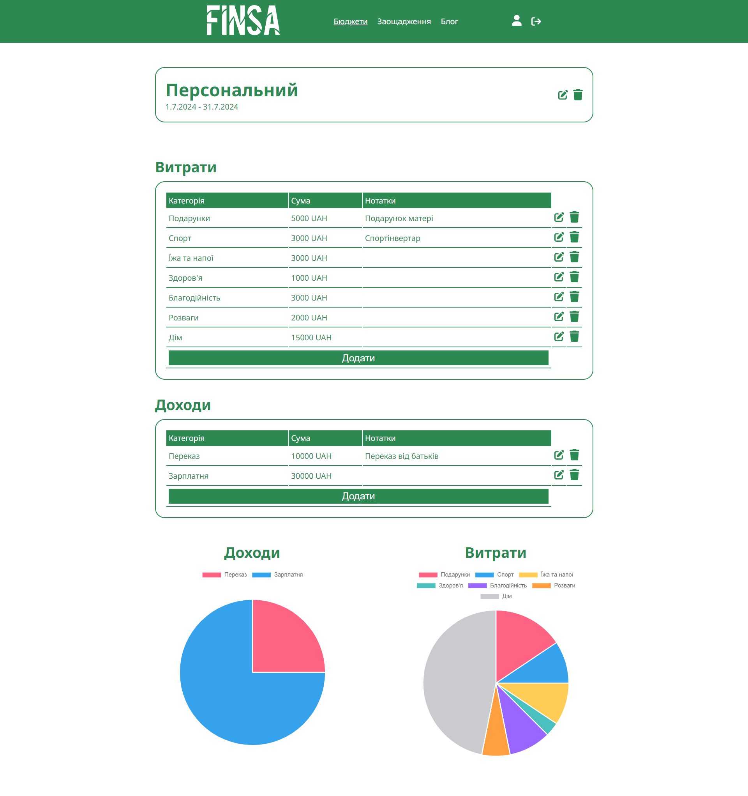

# Finsa App - Web Application for budget creation and savings monitoring

The application provides users with the ability to create and customize budgets, track income and expenses, and generate graphs for analyzing financial transactions.

## Features
- SignUp, LogIn, LogOut: Users can create an account, securely log in, and log out to manage their sessions.
- Profile Settings: Users can update personal information.
- Budgets: Users can create and manage financial budgets, track expenses and incomes.
- Savings: Users can control their savings.
- Blog Page: Users with special role "creator" can create helpful articles about finances.

[You can see how it works here.](https://drive.google.com/file/d/1x_p4u-Pe5dgTInMAKMtmPDyys7qTweZ7/view?usp=sharing)

